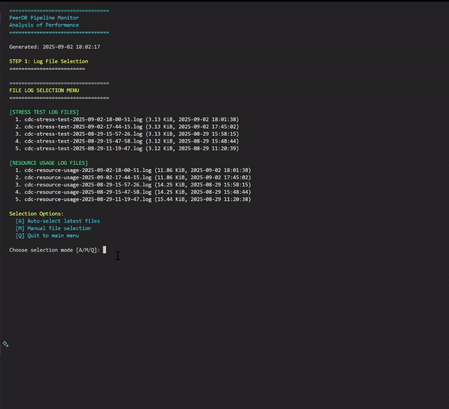

# 📱 Debezium CDC Mirroring with Grafana Monitoring: Real-time PostgreSQL Replication

> Log-based data replication pipeline using Debezium, Kafka, Kafka Connect, PostgreSQL with comprehensive monitoring via Prometheus and Grafana.

## 🔧 **FINAL STATUS: COMPREHENSIVE MONITORING COMPLETE** 

✅ **ALL SERVICES VERIFIED & WORKING** - Semua layanan telah ditest dan berfungsi sempurna
✅ **GRAFANA DASHBOARD READY** - Monitoring real-time dengan Grafana di port 3000
✅ **PROMETHEUS METRICS INTEGRATED** - Metrics collection dari semua services
✅ **MULTI-EXPORTER SETUP** - PostgreSQL, Kafka, dan Node exporters aktif

### **🎯 ENHANCED MONITORING FEATURES:**
- **Grafana Dashboard**: Real-time visualization di [http://localhost:3000](http://localhost:3000) (admin/admin)
- **Prometheus Metrics**: Raw metrics di [http://localhost:9090](http://localhost:9090) 
- **PostgreSQL Monitoring**: Source & Target database metrics via postgres-exporter
- **Kafka Metrics**: Kafka broker monitoring via kafka-exporter  
- **System Resources**: Node-exporter untuk system-level metrics
- **Container Health**: Docker container monitoring dan resource usage

---

---

## 📌 Overview

This project demonstrates a **real-time data replication** architecture using **Debezium** and **Apache Kafka** to capture changes (CDC) from a PostgreSQL source database and mirror them into a PostgreSQL target database.

### 🌐 Context:

* **Source DB**: `inventory`
* **Source Schema**: `inventory`
* **Source Table**: `orders`
* **Target DB**: `postgres`
* **Target Schema**: `public`
* **Target Table**: `orders`

📌 *Note: You can skip dropping foreign keys by pre-populating the referenced data. See example datasets below.*

### 🚀 New Dynamic Testing Features:

* **Real-time Data Fetching**: No hardcoded IDs or values
* **Environment-aware Configuration**: Supports config files and environment variables
* **Auto-discovery**: Automatically detects Docker containers and database schemas
* **Dynamic Data Generation**: Uses live database data for realistic testing
* **Configurable Performance Testing**: Adaptive batch sizing and concurrent operations

---

## 💡 Why CDC & Streaming?

Synchronizing data across systems in real time is a challenge. Traditional ETL tools introduce latency, and direct queries often overload production databases.

**Debezium** offers a **non-intrusive, log-based mechanism** to stream changes efficiently using Kafka — making it ideal for:

* Real-time backups
* Microservice synchronization
* Streaming data to analytics pipelines
* Data validation and monitoring

---

## 🔗 Data Flow Architecture

```
[Postgres Source] → [Debezium Source Connector] → [Kafka Broker] → [JDBC Sink Connector] → [Postgres Target]
                                                         ↓
                                           [Dynamic Testing & Monitoring]
```

**Components:**

* **Postgres Source**: Origin DB using WAL (Write-Ahead Log)
* **Debezium**: Captures changes in real time
* **Kafka Broker + Zookeeper**: Streams changes across connectors
* **Kafka Connect (JDBC Sink)**: Pushes data to target
* **Postgres Target**: Receives updates
* **Dynamic Testing Suite**: Real-time performance and validation testing

---

## 📁 Project Structure

```
debezium-grafana/
├─ docker-compose.yaml                  # Main deployment file with monitoring stack
├─ inventory-source.json                # Debezium connector config
├─ pg-sink.json                         # JDBC sink config  
├─ prometheus.yaml                      # Prometheus configuration
├─ plugins/
│   ├─ debezium-connector-postgres/     # Debezium PostgreSQL connector
│   └─ confluentinc-kafka-connect-jdbc/ # JDBC sink connector
├─ scripts/
│   ├─ insert_debezium.ps1             # Insert stress test script
│   └─ monitoring_debezium.ps1          # Pipeline monitoring script
├─ connector/                           # Additional connector configs
└─ README.md
```

## 🌐 Services & Ports

| Service | Port | URL | Description |
|---------|------|-----|-------------|
| Grafana | 3000 | [http://localhost:3000](http://localhost:3000) | Dashboard & Visualization (admin/admin) |
| Prometheus | 9090 | [http://localhost:9090](http://localhost:9090) | Metrics Collection |
| Kafdrop | 9000 | [http://localhost:9000](http://localhost:9000) | Kafka Web UI |
| Kafka Connect | 8083 | [http://localhost:8083](http://localhost:8083) | Connect REST API |
| PostgreSQL (Source) | 5432 | - | Source Database (inventory) |
| PostgreSQL (Target) | 5433 | - | Target Database |
| Kafka | 9092 | - | Message Broker |
| Zookeeper | 2181 | - | Kafka Coordination |
| Postgres Exporter (Source) | 9187 | - | Source DB Metrics |
| Postgres Exporter (Target) | 9188 | - | Target DB Metrics |
| Kafka Exporter | 9308 | - | Kafka Metrics |
| Node Exporter | 9100 | - | System Metrics |
│   ├─ Scripts-Quick-Reference.md       # Usage guide
│   └─ Scripts-Documentation.md         # Output analysis
├─ testing-results/                     # Auto-generated logs
└─ README.md
```

---

## 🚀 Quick Start Guide

### ✅ Step 1: Clone & Spin Up Docker Stack

```powershell
# Navigate to the project folder
cd c:\debezium-grafana

# Start all services including monitoring stack
docker-compose up -d

# Verify all services are running
docker-compose ps
```

### ✅ Step 2: Access Monitoring Dashboards

**🎯 Grafana Dashboard (Primary UI)**
1. Open [http://localhost:3000](http://localhost:3000)
2. Login: `admin` / `admin` 
3. Import or create dashboards for:
   - PostgreSQL performance metrics
   - Kafka topic monitoring  
   - System resource usage
   - CDC pipeline health

**📊 Prometheus Metrics (Raw Data)**
1. Open [http://localhost:9090](http://localhost:9090)
2. Query examples:
   - `postgres_up` - Database connectivity
   - `kafka_server_brokertopicmetrics_messages_in_total` - Kafka throughput
   - `node_cpu_seconds_total` - CPU usage

### ✅ Step 3: Register Connectors & Setup CDC

**🔧 Via Terminal (Recommended for Automation)**
```powershell
# Register Debezium source connector
Invoke-RestMethod -Uri http://localhost:8083/connectors -Method Post -ContentType "application/json" -InFile "./inventory-source.json"

# Register JDBC sink connector  
Invoke-RestMethod -Uri http://localhost:8083/connectors -Method Post -ContentType "application/json" -InFile "./pg-sink.json"
```
netstat -ano | findstr :5432
taskkill /PID 2568 /F
## PowerShell Scripts


<br>

=======
<b>Insert Test Animation:</b><br>


```powershell
# Set execution policy (jika diperlukan)
Set-ExecutionPolicy -Scope Process -ExecutionPolicy Bypass

# Jalankan insert test
.\scripts\insert_debezium.ps1 70000000
```


<br>

=======
<b>Monitoring Animation:</b><br>


```powershell
# Monitor pipeline performance
.\scripts\monitoring_debezium.ps1
```

**Custom Insert Parameters:**
```powershell
# Test ringan
.\scripts\insert_debezium.ps1 -RecordCount 500 -BatchSize 50

# Test standar dengan progress
.\scripts\insert_debezium.ps1 -RecordCount 2000 -BatchSize 200 -ShowProgress

# Stress test
.\scripts\insert_debezium.ps1 -RecordCount 10000 -BatchSize 1000 -DelayBetweenBatches 0
```

### ✅ Step 3: Check Connected Connectors

Untuk melihat daftar connector yang sudah aktif di Kafka Connect:

**PowerShell:**
```powershell
Invoke-WebRequest -Uri http://localhost:8083/connectors | Select-Object -ExpandProperty Content
```

**Command Prompt / Git Bash:**
```bash
curl http://localhost:8083/connectors
```

Untuk melihat status detail connector tertentu:

**PowerShell:**
```powershell
Invoke-WebRequest -Uri http://localhost:8083/connectors/<NAMA_CONNECTOR>/status | Select-Object -ExpandProperty Content
```

**Command Prompt / Git Bash:**
```bash
curl http://localhost:8083/connectors/<NAMA_CONNECTOR>/status
```

Ganti `<NAMA_CONNECTOR>` dengan nama connector yang ingin dicek.

### ✅ Step 4: Check Source Database Connection

```powershell
# Connect to source PostgreSQL
docker exec -it debezium-grafana-postgres-1 psql -U postgres -d inventory

# Check table structure
\d inventory.orders

# View existing data
SELECT * FROM inventory.orders LIMIT 5;
```

### ✅ Step 5: Check Target Database Connection  

```powershell
# Connect to target PostgreSQL
docker exec -it debezium-grafana-target-postgres-1 psql -U postgres -d postgres

# Check replicated data
SELECT * FROM public.orders LIMIT 5;
```

### ✅ Step 6: Monitor with Grafana

1. **Import Dashboard Templates**:
   - PostgreSQL Dashboard ID: `9628`
   - Kafka Dashboard ID: `7589`  
   - Docker Dashboard ID: `893`
   
2. **Create Custom Queries**:
   ```promql
   # CDC lag monitoring
   rate(kafka_server_brokertopicmetrics_messages_in_total[5m])
   
   # Database connection count
   postgres_stat_database_numbackends
   
   # System resource usage
   rate(node_cpu_seconds_total[5m]) * 100
   ```

3. **Set Up Alerts** untuk threshold monitoring

### ✅ Step 6: Perform CRUD Operations

#### 🔹 Insert

```sql
INSERT INTO inventory.orders(order_date, purchaser, quantity, product_id, keterangan)
VALUES ('2025-07-08', 1002, 3, 107, 'CDC TEST');
```

#### 🔹 Update

```sql
UPDATE inventory.orders
SET keterangan = 'UPDATED FROM SOURCE'
WHERE purchaser = 999;
```

#### 🔹 Delete

```sql
DELETE FROM inventory.orders
WHERE purchaser = 999;
```

📌 *Alternative to dropping FK: Pre-insert into `customers` and `products`:*

```sql
INSERT INTO inventory.customers(id, first_name, last_name, email) VALUES (999, 'Dummy', 'Customer', 'dummy@mail.com');
INSERT INTO inventory.products(id, name, description, weight) VALUES (999, 'Dummy Product', 'test', 1);
```

### ✅ Step 7: Check Replication Result in Target DB

```bash
docker exec -it debezium-cdc-mirroring-target-postgres-1 psql -U postgres -d postgres
SELECT * FROM public.orders;
```

---

## 📊 Scripts & Monitoring

### 🚀 Insert Data Testing
Script `insert_debezium.ps1` melakukan stress test insert data ke database source dengan fitur:
- Real-time data fetching dari customers dan products
- Configurable batch size dan record count
- Resource monitoring per batch
- Automatic logging ke folder `testing-results/`

###  Pipeline Monitoring  
Script `monitoring_debezium.ps1` memberikan monitoring komprehensif:
- Container health dan resource usage
- Database connection dan performance
- Kafka topics dan consumer groups
- CDC connector status dan replication lag
- WAL monitoring dan slot status
- Performance metrics dan recommendations

### 📁 Output & Logs
Semua hasil test dan monitoring tersimpan di:
- `testing-results/cdc-stress-test-[timestamp].log` - Detail insert test
- `testing-results/cdc-resource-usage-[timestamp].log` - Resource monitoring

**Contoh Performance Results:**
```
Test Duration: 00:00:44
Throughput: 22.51 operations/second
Success Rate: 100%
Average Batch Time: 184.45ms
Sync Status: SYNCHRONIZED
```

###  Documentation
- **[Scripts Quick Reference](docs/Scripts-Quick-Reference.md)** - Panduan penggunaan lengkap
- **[Scripts Documentation](docs/Scripts-Documentation.md)** - Analisis output dan hasil

---

## 🔧 Advanced Configuration

### Parameter Optimization
- **Light Test**: `RecordCount=500, BatchSize=50`
- **Standard Test**: `RecordCount=2000, BatchSize=200`
- **Stress Test**: `RecordCount=10000, BatchSize=1000`
- **Optimal Performance**: `BatchSize=500` (sweet spot)

### Monitoring Strategy
```powershell
# Pre-test baseline
.\scripts\monitoring_debezium.ps1

# Execute test
.\scripts\insert_debezium.ps1 -RecordCount 5000 -BatchSize 500

# Post-test analysis
.\scripts\monitoring_debezium.ps1
```

---

## 🌐 Web UIs & Monitoring

### 🎯 **Grafana Dashboard** (Primary Monitoring)
- **URL**: [http://localhost:3000](http://localhost:3000)  
- **Login**: `admin` / `admin`
- **Fungsi**: 
  - Real-time metrics visualization
  - Custom dashboards untuk PostgreSQL, Kafka, System
  - Alert management dan notifications
  - Historical data analysis
  - Performance trend monitoring

### 📊 **Prometheus** (Metrics Collection)
- **URL**: [http://localhost:9090](http://localhost:9090)
- **Fungsi**: 
  - Raw metrics data dan queries
  - Target monitoring status
  - Service discovery
  - Alert rule configuration

### 🌐 **Kafdrop** (Kafka Web UI)
- **URL**: [http://localhost:9000](http://localhost:9000)
- **Fungsi**: Monitor Kafka topics, partitions, messages, consumer groups

### 🔌 **Kafka Connect REST API**
- **URL**: [http://localhost:8083](http://localhost:8083)
- **Endpoints**:
  - `GET /connectors` - List connectors
  - `GET /connectors/{name}/status` - Connector status  
  - `POST /connectors` - Create connector
  - `DELETE /connectors/{name}` - Delete connector

---

## 🛡️ View Events and Validate

### 🔍 Option A: Via CMD

```bash
docker exec -it kafka-tools kafka-console-consumer --bootstrap-server kafka:9092 --topic dbserver1.inventory.orders --from-beginning
```

### 🌐 Option B: Via Web UI (Kafdrop)

Access: [http://localhost:9000](http://localhost:9000)

* Inspect topics, partitions, and payload in browser

### 🔧 Check Running Connectors

```bash
curl http://localhost:8083/connectors
```

---

## 🚩 Shutdown & Clean Up

Setelah selesai menggunakan:

```powershell
# Option A (dengan penghapusan volume data)
docker-compose down -v

# Option B (menjaga data volume)  
docker-compose down

# Option C (stop services saja, restart cepat)
docker-compose stop
```

**⚠️ Don’t forget to stop containers after use to avoid memory or port issues.**

---

## ✅ Optional: Connect via DBeaver

> Create a PostgreSQL connection for both source and sink:

### 🔹 Source (inventory):

* Host: `localhost`
* Port: `5432`
* Database: `inventory`
* User: `postgres`
* Password: `postgres`

### 🔹 Target (postgres):

* Host: `localhost`
* Port: `5433`
* Database: `postgres`
* User: `postgres`
* Password: `postgres`

Click **Test Connection**, then **Finish**.

---

## 🗂️ ERD & Sample Data

### 🧩 ERD

> Below is the simplified ERD of the source `inventory` database.


### 📌 Sample Data Extract

```sql
-- Sample: customers
SELECT * FROM inventory.customers;
-- Sample: products
SELECT * FROM inventory.products;
-- Sample: orders
SELECT * FROM inventory.orders;
```

---

## 🛠️ Tech Stack

* **Debezium 2.6** - PostgreSQL CDC connector
* **Apache Kafka & Kafka Connect** (Confluent) - Message streaming
* **PostgreSQL** - Source and target databases  
* **Grafana** - Dashboard dan visualization platform
* **Prometheus** - Metrics collection dan storage
* **PostgreSQL Exporter** - Database metrics export 
* **Kafka Exporter** - Kafka metrics export
* **Node Exporter** - System metrics export
* **Docker Compose** - Container orchestration
* **Kafdrop** - Kafka Web UI untuk monitoring
* **PowerShell Scripts** - Automated testing dan monitoring

---

## 📖 References & Documentation

* **[Scripts Quick Reference](docs/Scripts-Quick-Reference.md)** - Complete usage guide
* **[Scripts Documentation](docs/Scripts-Documentation.md)** - Output analysis and troubleshooting
* [Debezium Documentation](https://debezium.io/documentation/)
* [Kafka Connect JDBC Sink](https://docs.confluent.io/kafka-connect-jdbc/current/index.html)
* [Docker Compose Guide](https://docs.docker.com/compose/)

---


