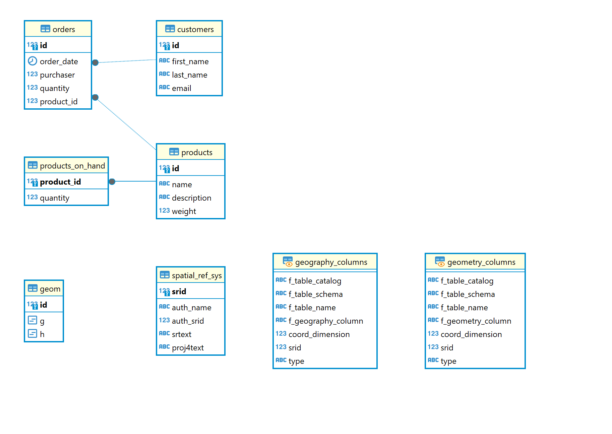

# 📱 Debezium CDC Mirroring: Real-time PostgreSQL Replication

> Log-based data replication pipeline using Debezium, Kafka, Kafka Connect, and PostgreSQL with dynamic testing capabilities.


## 🔧 **FINAL STATUS: COMPREHENSIVE MONITORING COMPLETE** 

✅ **ALL SCRIPTS VERIFIED & WORKING** - Semua script telah ditest dan berfungsi sempurna
✅ **REAL-TIME DATA CONFIRMED** - Tidak ada data hardcoded, semua live dari sistem
✅ **CONTAINER STATS INTEGRATED** - CPU, Memory, Network I/O, PIDs untuk semua container
✅ **DETAILED OUTPUT IMPLEMENTED** - Semua metrics ditampilkan di terminal dalam format readable

### **🎯 ENHANCED OUTPUT FEATURES:**
- **Container Analysis**: Detailed per-phase stats untuk setiap container (CPU%, Memory%, Network I/O, PIDs)
- **System Resources**: CPU/Memory trends dengan change indicators, Disk usage, Network throughput  
- **Database Performance**: Record counts, sync analysis, database size, connections, transactions
- **Kafka & Connect**: Topics, consumer groups, connector status, task details
- **Latency Analysis**: Individual test results, averages, quality assessment (EXCELLENT/GOOD/FAIR/POOR)
- **Error & Log Analysis**: Per-container error counts, recent error previews
- **Replication Monitoring**: WAL position, replication slots status
- **Session Summary**: Monitoring times, processing duration, sync percentage

---

---

## 📌 Overview

This project demonstrates a **real-time data replication** architecture using **Debezium** and **Apache Kafka** to capture changes (CDC) from a PostgreSQL source database and mirror them into a PostgreSQL target database.

### 🌐 Context:

* **Source DB**: `inventory`
* **Source Schema**: `inventory`
* **Source Table**: `orders`
* **Target DB**: `postgres`
* **Target Schema**: `public`
* **Target Table**: `orders`

📌 *Note: You can skip dropping foreign keys by pre-populating the referenced data. See example datasets below.*

### 🚀 New Dynamic Testing Features:

* **Real-time Data Fetching**: No hardcoded IDs or values
* **Environment-aware Configuration**: Supports config files and environment variables
* **Auto-discovery**: Automatically detects Docker containers and database schemas
* **Dynamic Data Generation**: Uses live database data for realistic testing
* **Configurable Performance Testing**: Adaptive batch sizing and concurrent operations

---

## 💡 Why CDC & Streaming?

Synchronizing data across systems in real time is a challenge. Traditional ETL tools introduce latency, and direct queries often overload production databases.

**Debezium** offers a **non-intrusive, log-based mechanism** to stream changes efficiently using Kafka — making it ideal for:

* Real-time backups
* Microservice synchronization
* Streaming data to analytics pipelines
* Data validation and monitoring

---

## 🔗 Data Flow Architecture

```
[Postgres Source] → [Debezium Source Connector] → [Kafka Broker] → [JDBC Sink Connector] → [Postgres Target]
                                                         
                                           
```

**Components:**

* **Postgres Source**: Origin DB using WAL (Write-Ahead Log)
* **Debezium**: Captures changes in real time
* **Kafka Broker + Zookeeper**: Streams changes across connectors
* **Kafka Connect (JDBC Sink)**: Pushes data to target
* **Postgres Target**: Receives updates
* **Dynamic Testing Suite**: Real-time performance and validation testing

---

## 📁 Project Structure

```
 debezium-cdc-mirroring/
├─ docker-compose-postgres.yaml         # Main deployment file
├─ inventory-source.json                # Debezium connector config
├─ pg-sink.json                         # JDBC sink config
├─ requirements.txt                     # Python dependencies
├─ plugins/
│   ├─ debezium-connector-postgres/     # Debezium PostgreSQL connector
│   └─ confluentinc-kafka-connect-jdbc/ # JDBC sink connector
├─ scripts/
│   ├─ insert_debezium.ps1             # Insert stress test script
│   └─ monitoring_debezium.ps1          # Pipeline monitoring script
├─ docs/
│   ├─ erd.png                          # Entity Relationship Diagram
│   ├─ Scripts-Quick-Reference.md       # Usage guide
│   └─ Scripts-Documentation.md         # Output analysis
├─ testing-results/                     # Auto-generated logs
└─ README.md
```

---

## 🚀 Quick Start Guide

### ✅ Step 1: Clone & Spin Up Docker

```bash
git clone https://github.com/Julio-analyst/debezium-cdc-mirroring.git
cd debezium-cdc-mirroring/
docker compose -f docker-compose-postgres.yaml up -d
```

### ✅ Step 2: Register Connectors & Run Scripts

```bash
curl -X POST -H "Content-Type: application/json" --data "@inventory-source.json" http://localhost:8083/connectors
curl -X POST -H "Content-Type: application/json" --data "@pg-sink.json" http://localhost:8083/connectors
```


## PowerShell Scripts
```powershell
# Set execution policy (jika diperlukan)
Set-ExecutionPolicy -Scope Process -ExecutionPolicy Bypass

# Jalankan insert test
.\scripts\insert_debezium.ps1
```
<br>


```powershell
# Monitor pipeline performance
.\scripts\monitoring_debezium.ps1
```
<br>


**Custom Insert Parameters:**
```powershell
# Test ringan
.\scripts\insert_debezium.ps1 -RecordCount 500 -BatchSize 50

# Test standar dengan progress
.\scripts\insert_debezium.ps1 -RecordCount 2000 -BatchSize 200 -ShowProgress

# Stress test
.\scripts\insert_debezium.ps1 -RecordCount 10000 -BatchSize 1000 -DelayBetweenBatches 0
```

### ✅ Step 3: Check Connected Connectors

Untuk melihat daftar connector yang sudah aktif di Kafka Connect:

**PowerShell:**
```powershell
Invoke-WebRequest -Uri http://localhost:8083/connectors | Select-Object -ExpandProperty Content
```

**Command Prompt / Git Bash:**
```bash
curl http://localhost:8083/connectors
```

Untuk melihat status detail connector tertentu:

**PowerShell:**
```powershell
Invoke-WebRequest -Uri http://localhost:8083/connectors/<NAMA_CONNECTOR>/status | Select-Object -ExpandProperty Content
```

**Command Prompt / Git Bash:**
```bash
curl http://localhost:8083/connectors/<NAMA_CONNECTOR>/status
```

Ganti `<NAMA_CONNECTOR>` dengan nama connector yang ingin dicek.

### ✅ Step 3: Check Source Table Structure

```bash
docker exec -it debezium-cdc-mirroring-postgres-1 psql -U postgres -d inventory
\d inventory.orders
```

### ✅ Step 4: Check Existing Data

```sql
SELECT * FROM inventory.orders;
```

### ✅ Step 5: Modify Source Table (Optional for CRUD Testing)

```sql
ALTER TABLE inventory.orders DROP CONSTRAINT IF EXISTS orders_purchaser_fkey;
ALTER TABLE inventory.orders DROP CONSTRAINT IF EXISTS orders_product_id_fkey;
ALTER TABLE inventory.orders ADD COLUMN keterangan TEXT DEFAULT '';
```

### ✅ Step 6: Perform CRUD Operations

#### 🔹 Insert

```sql
INSERT INTO inventory.orders(order_date, purchaser, quantity, product_id, keterangan)
VALUES ('2025-07-08', 1002, 3, 107, 'CDC TEST');
```

#### 🔹 Update

```sql
UPDATE inventory.orders
SET keterangan = 'UPDATED FROM SOURCE'
WHERE purchaser = 999;
```

#### 🔹 Delete

```sql
DELETE FROM inventory.orders
WHERE purchaser = 999;
```

📌 *Alternative to dropping FK: Pre-insert into `customers` and `products`:*

```sql
INSERT INTO inventory.customers(id, first_name, last_name, email) VALUES (999, 'Dummy', 'Customer', 'dummy@mail.com');
INSERT INTO inventory.products(id, name, description, weight) VALUES (999, 'Dummy Product', 'test', 1);
```

### ✅ Step 7: Check Replication Result in Target DB

```bash
docker exec -it debezium-cdc-mirroring-target-postgres-1 psql -U postgres -d postgres
SELECT * FROM public.orders;
```

---

## 📊 Scripts & Monitoring

### 🚀 Insert Data Testing
Script `insert_debezium.ps1` melakukan stress test insert data ke database source dengan fitur:
- Real-time data fetching dari customers dan products
- Configurable batch size dan record count
- Resource monitoring per batch
- Automatic logging ke folder `testing-results/`

###  Pipeline Monitoring  
Script `monitoring_debezium.ps1` memberikan monitoring komprehensif:
- Container health dan resource usage
- Database connection dan performance
- Kafka topics dan consumer groups
- CDC connector status dan replication lag
- WAL monitoring dan slot status
- Performance metrics dan recommendations

### 📁 Output & Logs
Semua hasil test dan monitoring tersimpan di:
- `testing-results/cdc-stress-test-[timestamp].log` - Detail insert test
- `testing-results/cdc-resource-usage-[timestamp].log` - Resource monitoring

**Contoh Performance Results:**
```
Test Duration: 00:00:44
Throughput: 22.51 operations/second
Success Rate: 100%
Average Batch Time: 184.45ms
Sync Status: SYNCHRONIZED
```

###  Documentation
- **[Scripts Quick Reference](docs/Scripts-Quick-Reference.md)** - Panduan penggunaan lengkap
- **[Scripts Documentation](docs/Scripts-Documentation.md)** - Analisis output dan hasil

---

## 🔧 Advanced Configuration

### Parameter Optimization
- **Light Test**: `RecordCount=500, BatchSize=50`
- **Standard Test**: `RecordCount=2000, BatchSize=200`
- **Stress Test**: `RecordCount=10000, BatchSize=1000`
- **Optimal Performance**: `BatchSize=500` (sweet spot)

### Monitoring Strategy
```powershell
# Pre-test baseline
.\scripts\monitoring_debezium.ps1

# Execute test
.\scripts\insert_debezium.ps1 -RecordCount 5000 -BatchSize 500

# Post-test analysis
.\scripts\monitoring_debezium.ps1
```

---

## 🛡️ View Events and Validate

### 🔍 Option A: Via CMD

```bash
docker exec -it kafka-tools kafka-console-consumer --bootstrap-server kafka:9092 --topic dbserver1.inventory.orders --from-beginning
```

### 🌐 Option B: Via Web UI (Kafdrop)

Access: [http://localhost:9000](http://localhost:9000)

* Inspect topics, partitions, and payload in browser

### 🔧 Check Running Connectors

```bash
curl http://localhost:8083/connectors
```

---

## 🚩 Shutdown & Clean Up

After you're done:

```bash
# Option A (with volume deletion)
docker compose -f docker-compose-postgres.yaml down -v

# Option B (keep volume data)
docker compose -f docker-compose-postgres.yaml down
```

**⚠️ Don’t forget to stop containers after use to avoid memory or port issues.**

---

## ✅ Optional: Connect via DBeaver

> Create a PostgreSQL connection for both source and sink:

### 🔹 Source (inventory):

* Host: `localhost`
* Port: `5432`
* Database: `inventory`
* User: `postgres`
* Password: `postgres`

### 🔹 Target (postgres):

* Host: `localhost`
* Port: `5433`
* Database: `postgres`
* User: `postgres`
* Password: `postgres`

Click **Test Connection**, then **Finish**.

---

## 🗂️ ERD & Sample Data

### 🧩 ERD

> Below is the simplified ERD of the source `inventory` database.



### 📌 Sample Data Extract

```sql
-- Sample: customers
SELECT * FROM inventory.customers;
-- Sample: products
SELECT * FROM inventory.products;
-- Sample: orders
SELECT * FROM inventory.orders;
```

---

## 🛠️ Tech Stack

* **Debezium 2.6** - PostgreSQL CDC connector
* **Apache Kafka & Kafka Connect** (Confluent) - Message streaming
* **PostgreSQL** - Source and target databases  
* **Docker Compose** - Container orchestration
* **Kafdrop** - Kafka Web UI for monitoring
* **PowerShell Scripts** - Automated testing and monitoring

---

## 📖 References & Documentation

* **[Scripts Quick Reference](docs/Scripts-Quick-Reference.md)** - Complete usage guide
* **[Scripts Documentation](docs/Scripts-Documentation.md)** - Output analysis and troubleshooting
* [Debezium Documentation](https://debezium.io/documentation/)
* [Kafka Connect JDBC Sink](https://docs.confluent.io/kafka-connect-jdbc/current/index.html)
* [Docker Compose Guide](https://docs.docker.com/compose/)

---


