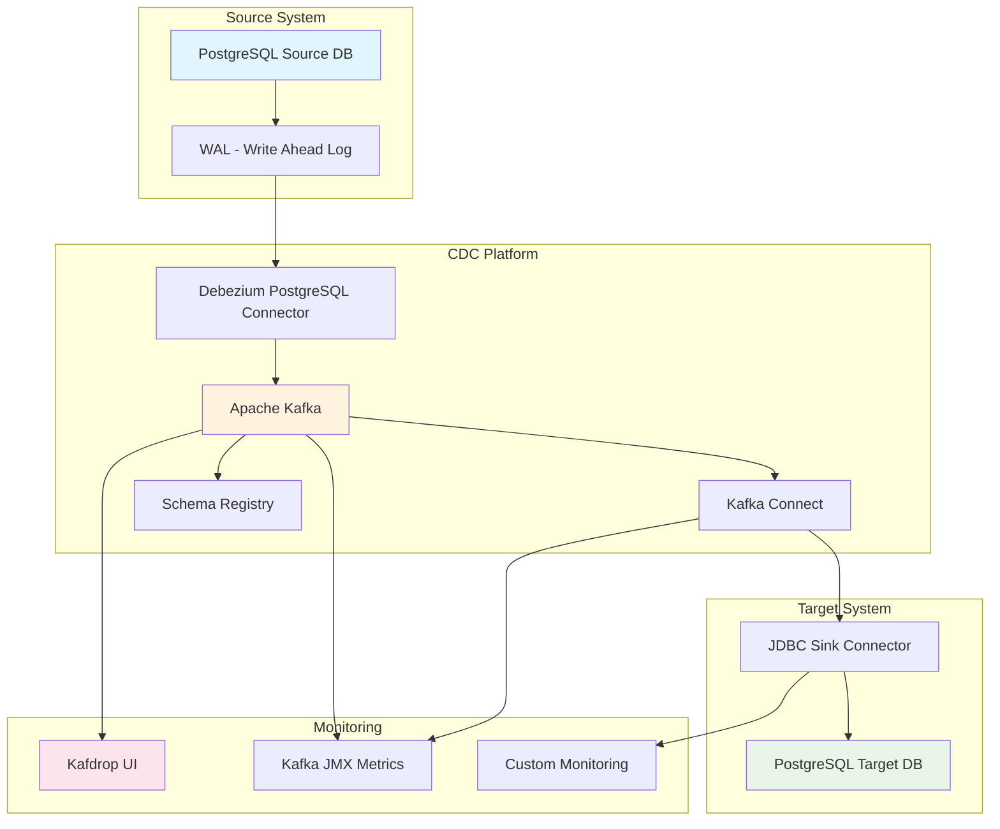
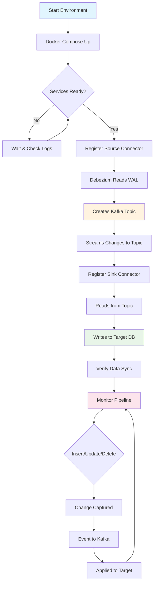
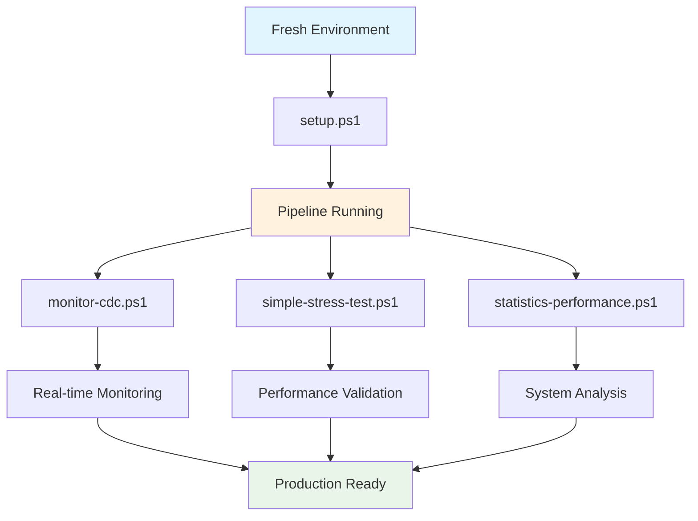

# 🚀 Debezium CDC Mirroring - Comprehensive Documentation

## 📋 Table of Contents
- [Overview](#-overview)
- [Architecture](#-architecture)
- [System Requirements](#-system-requirements)
- [Installation & Setup](#-installation--setup)
- [Configuration](#-configuration)
- [Operation & Monitoring](#-operation--monitoring)
- [Performance Testing](#-performance-testing)
- [Troubleshooting](#-troubleshooting)
- [Best Practices](#-best-practices)
- [Advanced Topics](#-advanced-topics)

---

## 🎯 Overview

### What is CDC (Change Data Capture)?
Change Data Capture (CDC) is a design pattern that identifies and captures changes made to data in a database and then delivers those changes in real-time to a downstream process or system.

### Why Debezium?
Debezium is an open-source platform for change data capture that:
- ✅ Provides low-latency streaming
- ✅ Ensures exactly-once delivery
- ✅ Handles schema evolution
- ✅ Offers fault tolerance
- ✅ Scales horizontally

### Project Scope
This implementation demonstrates:
- **PostgreSQL → PostgreSQL** real-time replication
- **Kafka-based** event streaming
- **Schema evolution** handling
- **Performance monitoring** and testing
- **Production-ready** configuration

---

## 🏗️ Architecture

### High-Level Architecture



### Component Details

#### 1. Source Database (PostgreSQL)
- **Role**: Origin of data changes
- **Technology**: PostgreSQL with WAL enabled
- **Configuration**: Logical replication enabled
- **Tables**: `inventory.orders`, `inventory.customers`, `inventory.products`

#### 2. Debezium PostgreSQL Connector
- **Role**: Captures changes from PostgreSQL WAL
- **Type**: Source connector
- **Output**: Kafka topics with change events
- **Schema**: Avro with Schema Registry

#### 3. Apache Kafka
- **Role**: Message broker for streaming events
- **Topics**: `dbserver1.inventory.orders`
- **Partitions**: Configurable based on load
- **Replication Factor**: 1 (development), 3+ (production)

#### 4. JDBC Sink Connector
- **Role**: Writes changes to target database
- **Type**: Sink connector
- **Input**: Kafka topics
- **Output**: PostgreSQL target database

#### 5. Target Database (PostgreSQL)
- **Role**: Destination for replicated data
- **Schema**: `public.orders`
- **Sync**: Real-time with source

---

## 💻 System Requirements

### Minimum Requirements
- **CPU**: 2 cores
- **RAM**: 4GB
- **Storage**: 20GB free space
- **OS**: Linux, macOS, Windows (with Docker)

### Recommended Requirements
- **CPU**: 4+ cores
- **RAM**: 8GB+
- **Storage**: 50GB+ SSD
- **Network**: 1Gbps+

### Software Dependencies
- Docker 20.10+
- Docker Compose 2.0+
- curl (for API calls)
- PostgreSQL client (optional)

---

## 🛠️ Installation & Setup

### Step 1: Environment Preparation

```bash
# Clone the repository
git clone https://github.com/Julio-analyst/debezium-cdc-mirroring.git
cd debezium-cdc-mirroring

# Verify Docker installation
docker --version
docker-compose --version

# Set up environment variables
export DEBEZIUM_VERSION=2.6
export KAFKA_VERSION=7.4.0
```

### Step 2: Infrastructure Deployment

```bash
# Start all services
docker-compose -f docker-compose-postgres.yaml up -d

# Verify services are running
docker-compose -f docker-compose-postgres.yaml ps

# Check service logs
docker-compose -f docker-compose-postgres.yaml logs -f
```

### Step 3: Service Verification

```bash
# Check Kafka Connect status
curl -s http://localhost:8083/connectors

# Check Kafka topics
docker exec -it kafka-tools kafka-topics --bootstrap-server kafka:9092 --list

# Check database connectivity
docker exec -it debezium-cdc-mirroring-postgres-1 psql -U postgres -d inventory -c "\dt"
```

---

## ⚙️ Configuration

### Debezium Source Connector Configuration

```json
{
  "name": "inventory-connector",
  "config": {
    "connector.class": "io.debezium.connector.postgresql.PostgresConnector",
    "tasks.max": "1",
    "database.hostname": "postgres",
    "database.port": "5432",
    "database.user": "postgres",
    "database.password": "postgres",
    "database.dbname": "inventory",
    "database.server.name": "dbserver1",
    "table.include.list": "inventory.orders",
    "plugin.name": "pgoutput",
    "publication.autocreate.mode": "filtered",
    "topic.prefix": "dbserver1",
    "schema.history.internal.kafka.bootstrap.servers": "kafka:9092",
    "schema.history.internal.kafka.topic": "schema-changes.inventory"
  }
}
```

### JDBC Sink Connector Configuration

```json
{
  "name": "pg-sink-connector",
  "config": {
    "connector.class": "io.confluent.connect.jdbc.JdbcSinkConnector",
    "tasks.max": "1",
    "topics": "dbserver1.inventory.orders",
    "connection.url": "jdbc:postgresql://target-postgres:5432/postgres",
    "connection.user": "postgres",
    "connection.password": "postgres",
    "insert.mode": "upsert",
    "pk.mode": "record_key",
    "pk.fields": "id",
    "auto.create": "true",
    "auto.evolve": "true",
    "transforms": "unwrap,extractKey,addTS",
    "transforms.unwrap.type": "io.debezium.transforms.ExtractNewRecordState",
    "transforms.extractKey.type": "org.apache.kafka.connect.transforms.ValueToKey",
    "transforms.extractKey.fields": "id",
    "transforms.addTS.type": "org.apache.kafka.connect.transforms.InsertField$Value",
    "transforms.addTS.timestamp.field": "_synced_at"
  }
}
```

### Performance Tuning Parameters

```properties
# Kafka Configuration
num.network.threads=8
num.io.threads=16
socket.send.buffer.bytes=102400
socket.receive.buffer.bytes=102400
socket.request.max.bytes=104857600

# Debezium Configuration
max.batch.size=2048
max.queue.size=8192
poll.interval.ms=1000

# JDBC Sink Configuration
batch.size=3000
max.retries=10
retry.backoff.ms=3000
```

---

## � Manual CDC Pipeline Flow

### Step-by-Step Process Flow

This section provides a detailed manual explanation of how the CDC pipeline operates, including the exact commands and verification steps for each phase.

#### Flow Diagram



### Phase 1: Environment Setup

#### 1.1 Start Infrastructure
```powershell
# Start all services using Docker Compose
docker-compose -f docker-compose-postgres.yaml up -d

# Expected output: All containers starting
# Creating network "debezium-cdc-mirroring_default" with the default driver
# Creating debezium-cdc-mirroring-zookeeper-1 ... done
# Creating debezium-cdc-mirroring-postgres-1 ... done
# Creating debezium-cdc-mirroring-kafka-1 ... done
# Creating debezium-cdc-mirroring-kafka-connect-1 ... done
```

#### 1.2 Verify Services Status
```powershell
# Check if all containers are running
docker-compose -f docker-compose-postgres.yaml ps

# Expected output should show all services as "Up"
# NAME                                    STATE
# debezium-cdc-mirroring-postgres-1      Up
# debezium-cdc-mirroring-kafka-1         Up
# debezium-cdc-mirroring-kafka-connect-1 Up
# debezium-cdc-mirroring-zookeeper-1     Up
```

#### 1.3 Wait for Services to Initialize
```powershell
# Wait for Kafka Connect to be ready (usually takes 30-60 seconds)
do {
    $response = try { Invoke-RestMethod -Uri "http://localhost:8083/connectors" -ErrorAction Stop } catch { $null }
    if ($response -ne $null) { 
        Write-Host "✅ Kafka Connect is ready!" -ForegroundColor Green
        break 
    }
    Write-Host "⏳ Waiting for Kafka Connect..." -ForegroundColor Yellow
    Start-Sleep -Seconds 5
} while ($true)
```

### Phase 2: Source Connector Registration

#### 2.1 Register Debezium PostgreSQL Connector
```powershell
# Register the source connector to capture changes from PostgreSQL
$headers = @{"Content-Type" = "application/json"}
$sourceConfig = Get-Content "inventory-source.json" -Raw

Invoke-RestMethod -Uri "http://localhost:8083/connectors" -Method POST -Headers $headers -Body $sourceConfig

# Expected response:
# {
#   "name": "inventory-connector",
#   "config": { ... },
#   "tasks": [],
#   "type": "source"
# }
```

#### 2.2 Verify Source Connector Status
```powershell
# Check connector status
$status = Invoke-RestMethod -Uri "http://localhost:8083/connectors/inventory-connector/status"
Write-Host "Source Connector State: $($status.connector.state)" -ForegroundColor Green

# Expected output: "RUNNING"
```

#### 2.3 Verify Topic Creation
```powershell
# List Kafka topics to confirm the connector created the topic
docker exec kafka-tools kafka-topics --bootstrap-server kafka:9092 --list

# Expected output should include:
# dbserver1.inventory.orders
# schema-changes.inventory
```

### Phase 3: Data Flow Verification

#### 3.1 Insert Test Data in Source Database
```powershell
# Connect to source PostgreSQL and insert test data
$testSql = @"
INSERT INTO inventory.orders (order_date, purchaser, quantity, product_id, keterangan) 
VALUES ('2025-01-15', 1001, 5, 101, 'Manual Test Order');
"@

docker exec -i postgres psql -U postgres -d inventory -c $testSql

# Expected output: INSERT 0 1
```

#### 3.2 Verify Message in Kafka Topic
```powershell
# Check if the change event appeared in the Kafka topic
docker exec kafka-tools kafka-console-consumer --bootstrap-server kafka:9092 --topic dbserver1.inventory.orders --from-beginning --max-messages 1

# Expected output: JSON message with the change event data
# {"before": null, "after": {"id": 1, "order_date": "2025-01-15", ...}}
```

### Phase 4: Sink Connector Registration

#### 4.1 Register JDBC Sink Connector
```powershell
# Register the sink connector to write changes to target PostgreSQL
$sinkConfig = Get-Content "pg-sink.json" -Raw

Invoke-RestMethod -Uri "http://localhost:8083/connectors" -Method POST -Headers $headers -Body $sinkConfig

# Expected response:
# {
#   "name": "pg-sink-connector",
#   "config": { ... },
#   "tasks": [],
#   "type": "sink"
# }
```

#### 4.2 Verify Sink Connector Status
```powershell
# Check sink connector status
$sinkStatus = Invoke-RestMethod -Uri "http://localhost:8083/connectors/pg-sink-connector/status"
Write-Host "Sink Connector State: $($sinkStatus.connector.state)" -ForegroundColor Green

# Expected output: "RUNNING"
```

### Phase 5: End-to-End Verification

#### 5.1 Verify Data in Target Database
```powershell
# Check if data was replicated to target database
$count = docker exec -i target-postgres psql -U postgres -d postgres -t -c "SELECT COUNT(*) FROM orders;"
Write-Host "Target database record count: $($count.Trim())" -ForegroundColor Cyan

# Expected output: Same count as source database
```

#### 5.2 Compare Source and Target Data
```powershell
# Get data from both databases for comparison
$sourceData = docker exec -i postgres psql -U postgres -d inventory -t -c "SELECT id, order_date, purchaser FROM inventory.orders ORDER BY id;"
$targetData = docker exec -i target-postgres psql -U postgres -d postgres -t -c "SELECT id, order_date, purchaser FROM orders ORDER BY id;"

Write-Host "Source data:" -ForegroundColor Yellow
Write-Host $sourceData
Write-Host "Target data:" -ForegroundColor Yellow  
Write-Host $targetData

# Expected output: Both should show identical data
```

### Phase 6: Real-time Monitoring

#### 6.1 Monitor Connector Health
```powershell
# Continuous monitoring of connector status
while ($true) {
    $timestamp = Get-Date -Format "HH:mm:ss"
    
    # Check both connectors
    $sourceStatus = (Invoke-RestMethod -Uri "http://localhost:8083/connectors/inventory-connector/status").connector.state
    $sinkStatus = (Invoke-RestMethod -Uri "http://localhost:8083/connectors/pg-sink-connector/status").connector.state
    
    Write-Host "[$timestamp] Source: $sourceStatus | Sink: $sinkStatus" -ForegroundColor $(if ($sourceStatus -eq "RUNNING" -and $sinkStatus -eq "RUNNING") {"Green"} else {"Red"})
    
    Start-Sleep -Seconds 10
}
```

#### 6.2 Monitor Consumer Lag
```powershell
# Check replication lag
$lag = docker exec kafka-tools kafka-consumer-groups --bootstrap-server kafka:9092 --describe --group connect-pg-sink-connector

Write-Host "Consumer Lag Details:" -ForegroundColor Cyan
Write-Host $lag
```

### Phase 7: Test Real-time Replication

#### 7.1 Continuous Data Changes
```powershell
# Insert multiple records to test throughput
for ($i = 1; $i -le 10; $i++) {
    $sql = "INSERT INTO inventory.orders (order_date, purchaser, quantity, product_id, keterangan) VALUES ('2025-01-$(Get-Random -Minimum 1 -Maximum 28)', $(Get-Random -Minimum 1000 -Maximum 9999), $(Get-Random -Minimum 1 -Maximum 100), $(Get-Random -Minimum 101 -Maximum 110), 'Batch Test $i');"
    
    docker exec -i postgres psql -U postgres -d inventory -c $sql
    Write-Host "Inserted record $i" -ForegroundColor Green
    
    Start-Sleep -Seconds 2
}
```

#### 7.2 Real-time Verification
```powershell
# Monitor record counts in real-time
for ($i = 1; $i -le 5; $i++) {
    $sourceCount = docker exec -i postgres psql -U postgres -d inventory -t -c "SELECT COUNT(*) FROM inventory.orders;"
    $targetCount = docker exec -i target-postgres psql -U postgres -d postgres -t -c "SELECT COUNT(*) FROM orders;"
    
    $lag = ($sourceCount.Trim() -as [int]) - ($targetCount.Trim() -as [int])
    
    Write-Host "Source: $($sourceCount.Trim()) | Target: $($targetCount.Trim()) | Lag: $lag" -ForegroundColor $(if ($lag -eq 0) {"Green"} elseif ($lag -lt 5) {"Yellow"} else {"Red"})
    
    Start-Sleep -Seconds 5
}
```

### Manual Command Reference

#### Essential Verification Commands
```powershell
# Quick health check
curl -f http://localhost:8083/connectors

# List all connectors
curl -s http://localhost:8083/connectors

# Get connector status
curl -s http://localhost:8083/connectors/inventory-connector/status | ConvertFrom-Json

# View Kafka topics
docker exec kafka-tools kafka-topics --bootstrap-server kafka:9092 --list

# Read from topic (latest messages)
docker exec kafka-tools kafka-console-consumer --bootstrap-server kafka:9092 --topic dbserver1.inventory.orders --from-beginning --max-messages 5

# Database record counts
docker exec -i postgres psql -U postgres -d inventory -c "SELECT COUNT(*) FROM inventory.orders;"
docker exec -i target-postgres psql -U postgres -d postgres -c "SELECT COUNT(*) FROM orders;"
```

#### Troubleshooting Commands
```powershell
# View connector logs
docker-compose -f docker-compose-postgres.yaml logs kafka-connect

# Restart failed connector
curl -X POST http://localhost:8083/connectors/inventory-connector/restart

# Delete and recreate connector
curl -X DELETE http://localhost:8083/connectors/inventory-connector
# Then re-register with POST request

# Check database connections
docker exec -i postgres pg_isready -U postgres
docker exec -i target-postgres pg_isready -U postgres
```

This manual flow provides complete visibility into each step of the CDC pipeline, allowing you to understand exactly how changes flow from source to target through the Kafka-based streaming platform.

---

## �🔍 Operation & Monitoring

### Health Checks

```bash
# Check all services
./scripts/health-check.sh

# Individual service checks
curl -f http://localhost:8083/connectors || echo "Kafka Connect not ready"
curl -f http://localhost:9000 || echo "Kafdrop not ready"

# Database connectivity
docker exec postgres pg_isready -U postgres
docker exec target-postgres pg_isready -U postgres
```

### Monitoring Endpoints

| Service | Endpoint | Purpose |
|---------|----------|---------|
| Kafka Connect | http://localhost:8083 | REST API |
| Kafdrop | http://localhost:9000 | Web UI |
| JMX Metrics | localhost:9999 | Performance metrics |

### Log Monitoring

```bash
# Real-time logs
docker-compose -f docker-compose-postgres.yaml logs -f kafka-connect

# Error filtering
docker-compose logs kafka-connect 2>&1 | grep -i error

# Performance logs
docker-compose logs kafka-connect 2>&1 | grep -i "processing\|lag\|throughput"
```

---

## 📊 Performance Testing

### Test Suite Architecture



### Test Scripts

#### 1. Environment Setup Script

```powershell
# setup.ps1
Write-Host "🚀 Setting up CDC Pipeline..." -ForegroundColor Green

# Start services
docker-compose -f docker-compose-postgres.yaml up -d

# Wait for services
Start-Sleep -Seconds 30

# Register connectors
$headers = @{"Content-Type" = "application/json"}

Invoke-RestMethod -Uri "http://localhost:8083/connectors" -Method POST -Headers $headers -Body (Get-Content inventory-source.json -Raw)
Invoke-RestMethod -Uri "http://localhost:8083/connectors" -Method POST -Headers $headers -Body (Get-Content pg-sink.json -Raw)

Write-Host "✅ Setup completed!" -ForegroundColor Green
```

#### 2. Real-time Monitoring Script

```powershell
# monitor-cdc.ps1
Write-Host "📊 Starting CDC Monitoring..." -ForegroundColor Cyan

while ($true) {
    $timestamp = Get-Date -Format "yyyy-MM-dd HH:mm:ss"
    
    # Check connector status
    $connectors = Invoke-RestMethod -Uri "http://localhost:8083/connectors"
    
    # Get lag metrics
    $lag = docker exec kafka-tools kafka-consumer-groups --bootstrap-server kafka:9092 --describe --group connect-pg-sink-connector
    
    Write-Host "[$timestamp] Active Connectors: $($connectors.Count)" -ForegroundColor Green
    Write-Host "[$timestamp] Consumer Lag: $lag" -ForegroundColor Yellow
    
    Start-Sleep -Seconds 5
}
```

#### 3. Stress Testing Script

```powershell
# simple-stress-test.ps1
param(
    [int]$RecordCount = 1000,
    [int]$BatchSize = 100,
    [int]$DelayMs = 100
)

Write-Host "🔥 Starting Stress Test..." -ForegroundColor Red
Write-Host "Records: $RecordCount, Batch: $BatchSize" -ForegroundColor Yellow

$startTime = Get-Date

for ($i = 1; $i -le $RecordCount; $i += $BatchSize) {
    $batchEnd = [Math]::Min($i + $BatchSize - 1, $RecordCount)
    
    $sql = @"
INSERT INTO inventory.orders (order_date, purchaser, quantity, product_id, keterangan)
VALUES 
"@
    
    for ($j = $i; $j -le $batchEnd; $j++) {
        $sql += "('2025-01-$(($j % 28) + 1)', $j, $(Get-Random -Minimum 1 -Maximum 10), $(Get-Random -Minimum 101 -Maximum 110), 'Stress Test $j')"
        if ($j -lt $batchEnd) { $sql += "," }
    }
    
    docker exec -i postgres psql -U postgres -d inventory -c $sql
    
    Write-Host "Inserted batch: $i-$batchEnd" -ForegroundColor Green
    Start-Sleep -Milliseconds $DelayMs
}

$endTime = Get-Date
$duration = $endTime - $startTime

Write-Host "✅ Stress test completed!" -ForegroundColor Green
Write-Host "Duration: $($duration.TotalSeconds) seconds" -ForegroundColor Cyan
Write-Host "Throughput: $([Math]::Round($RecordCount / $duration.TotalSeconds, 2)) records/sec" -ForegroundColor Magenta
```

#### 4. Performance Statistics Script

```powershell
# statistics-performance.ps1
Write-Host "📈 Collecting Performance Statistics..." -ForegroundColor Magenta

# System metrics
$cpuUsage = Get-Counter "\Processor(_Total)\% Processor Time" -SampleInterval 1 -MaxSamples 1
$memUsage = Get-Counter "\Memory\Available MBytes" -SampleInterval 1 -MaxSamples 1

# Database metrics
$sourceCount = docker exec -i postgres psql -U postgres -d inventory -t -c "SELECT COUNT(*) FROM inventory.orders;"
$targetCount = docker exec -i target-postgres psql -U postgres -d postgres -t -c "SELECT COUNT(*) FROM orders;"

# Kafka metrics
$topicInfo = docker exec kafka-tools kafka-topics --bootstrap-server kafka:9092 --describe --topic dbserver1.inventory.orders

Write-Host "=== PERFORMANCE REPORT ===" -ForegroundColor Yellow
Write-Host "CPU Usage: $($cpuUsage.CounterSamples[0].CookedValue.ToString("F2"))%" -ForegroundColor Cyan
Write-Host "Available Memory: $($memUsage.CounterSamples[0].CookedValue) MB" -ForegroundColor Cyan
Write-Host "Source Records: $sourceCount" -ForegroundColor Green
Write-Host "Target Records: $targetCount" -ForegroundColor Green
Write-Host "Replication Lag: $(($sourceCount.Trim() -as [int]) - ($targetCount.Trim() -as [int])) records" -ForegroundColor $(if (($sourceCount.Trim() -as [int]) - ($targetCount.Trim() -as [int])) -eq 0) { "Green" } else { "Red" })
Write-Host "Topic Info: $topicInfo" -ForegroundColor Blue
```

### Performance Benchmarking

#### Throughput Testing
```bash
# High-volume insert test
./scripts/throughput-test.sh --records=10000 --threads=4

# Mixed workload test
./scripts/mixed-workload-test.sh --duration=300 --read-ratio=0.7
```

#### Latency Testing
```bash
# End-to-end latency measurement
./scripts/latency-test.sh --samples=1000

# Replication lag monitoring
./scripts/monitor-lag.sh --interval=1
```

---

## 🚨 Troubleshooting

### Common Issues

#### 1. Connector Startup Failures
```bash
# Check connector status
curl -s http://localhost:8083/connectors/inventory-connector/status

# View connector logs
docker-compose logs kafka-connect | grep inventory-connector

# Restart connector
curl -X POST http://localhost:8083/connectors/inventory-connector/restart
```

#### 2. Replication Lag
```bash
# Check consumer lag
docker exec kafka-tools kafka-consumer-groups \
  --bootstrap-server kafka:9092 \
  --describe --group connect-pg-sink-connector

# Increase parallelism
curl -X PUT http://localhost:8083/connectors/pg-sink-connector/config \
  -H "Content-Type: application/json" \
  -d '{"tasks.max": "4"}'
```

#### 3. Schema Evolution Issues
```bash
# Check schema registry
curl http://localhost:8081/subjects

# View schema versions
curl http://localhost:8081/subjects/dbserver1.inventory.orders-value/versions
```

### Diagnostic Commands

```bash
# Full system diagnosis
./scripts/diagnose.sh

# Database connectivity
./scripts/check-db-connections.sh

# Network connectivity
./scripts/check-network.sh

# Resource usage
./scripts/check-resources.sh
```

---

## 🎯 Best Practices

### Development
- ✅ Use schema registry for production
- ✅ Enable exactly-once semantics
- ✅ Implement proper error handling
- ✅ Monitor consumer lag
- ✅ Use meaningful topic names

### Production
- ✅ Set up monitoring and alerting
- ✅ Configure proper retention policies
- ✅ Implement backup strategies
- ✅ Use SSL/SASL authentication
- ✅ Deploy in multiple availability zones

### Performance
- ✅ Tune batch sizes appropriately
- ✅ Monitor and optimize connector tasks
- ✅ Use compression for large payloads
- ✅ Implement connection pooling
- ✅ Regular performance testing

---

## 🔬 Advanced Topics

### Schema Evolution
- Backward compatibility strategies
- Forward compatibility handling
- Schema registry integration
- Custom serializers

### Security
- SSL/TLS configuration
- SASL authentication
- Role-based access control
- Network security

### Scalability
- Horizontal scaling strategies
- Load balancing techniques
- Multi-region deployment
- Disaster recovery

### Integration Patterns
- Event sourcing with CDC
- CQRS implementation
- Microservices data synchronization
- Real-time analytics pipelines

---

## 📞 Support & Community

### Resources
- 📖 [Official Debezium Documentation](https://debezium.io/documentation/)
- 🎥 [Video Tutorials](https://debezium.io/documentation/tutorial/)
- 💬 [Community Forum](https://groups.google.com/forum/#!forum/debezium)
- 🐛 [Issue Tracker](https://github.com/debezium/debezium/issues)

### Contributing
We welcome contributions! Please read our [Contributing Guide](CONTRIBUTING.md) for details.

### License
This project is licensed under the MIT License. See [LICENSE](LICENSE) file for details.

---

*Last updated: $(Get-Date -Format "yyyy-MM-dd")*
